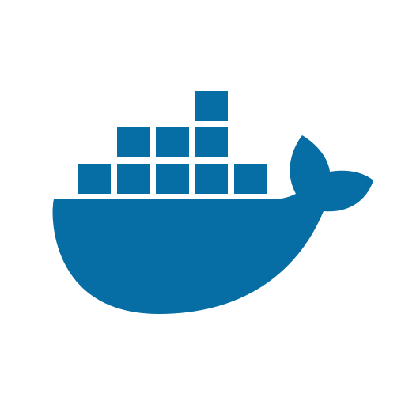

# Table of contents

* [Introduction](README.md)
* [Markdown Elements Guide](markdown-elements.md)

## Technology Icons Test

* [<i class="fa fa-github"></i> GitHub](README.md)
* [<i class="fa fa-html5"></i> HTML](README.md)
* [<i class="fa fa-css3"></i> CSS](README.md)
* [<i class="fa fa-js"></i> JavaScript](README.md)
* [<i class="fa fa-code"></i> TypeScript](README.md)
* [<i class="fa fa-angular"></i> Angular](README.md)
* [<i class="fa fa-feather"></i> NestJS](README.md)
* [<i class="fa fa-docker"></i> Docker](README.md)
* [<i class="fa fa-broom"></i> SOLID & Clean Code](README.md)
* [<i class="fa fa-sitemap"></i> Design Patterns](README.md)

## Emoji Icons Test

* [📄 Introduction](README.md)
* [🌐 Web Development](README.md)
* [🖥️ Backend Development](README.md)
* [📊 Databases](README.md)
* [🔧 DevOps](README.md)
* [🧪 Testing](README.md)
* [🔒 Security](README.md)
* [⚙️ Configuration](README.md)
* [📚 Documentation](README.md)
* [🧩 Design Patterns](README.md)

## Image Icons Test

* [ Docker Icon](README.md)
* [ Docker Named](README.md)
* [ Small Docker](README.md)

## Text Style Icons Test

* [**[HTML]** HTML Basics](README.md)
* [**[CSS]** CSS Styling](README.md)
* [**[JS]** JavaScript](README.md)
* [**[TS]** TypeScript](README.md)
* [**[ANG]** Angular](README.md)
* [**[REACT]** React](README.md)
* [**[VUE]** Vue.js](README.md)
* [**[NODE]** Node.js](README.md)
* [**[DB]** Databases](README.md)
* [**[DOCKER]** Docker](README.md)

## Unicode Symbols Test

* [⚛️ React](README.md)
* [🅰️ Angular](README.md)
* [🎯 Dart](README.md)
* [☕ Java](README.md)
* [🐍 Python](README.md)
* [🔷 TypeScript](README.md)
* [📦 npm](README.md)
* [🐳 Docker](README.md)
* [☁️ Cloud](README.md)
* [🔐 Security](README.md)

## Section 1: Programming Fundamentals

* [Programming Fundamentals](section1/README.md)
  * [Variables and Data Types](section1/variables-data-types/README.md)
    * [Numbers and Strings](section1/variables-data-types/numbers-strings.md)
    * [Arrays and Objects](section1/variables-data-types/arrays-objects.md)
    * [Type Conversion](section1/variables-data-types/type-conversion.md)
  * [Control Structures](section1/control-structures/README.md)
    * [Conditionals](section1/control-structures/conditionals.md)
    * [Loops](section1/control-structures/loops.md)
    * [Error Handling](section1/control-structures/error-handling.md)
  * [Functions](section1/functions/README.md)
    * [Function Basics](section1/functions/basics.md)
    * [Higher-Order Functions](section1/functions/higher-order.md)
    * [Recursion](section1/functions/recursion.md)

## Section 2: Web Development

* [Web Development](section2/README.md)
  * [HTML & CSS](section2/html-css/README.md)
    * [HTML Basics](section2/html-css/html-basics.md)
    * [CSS Styling](section2/html-css/css-styling.md)
    * [Responsive Design](section2/html-css/responsive-design.md)
  * [JavaScript for Web](section2/javascript-web/README.md)
    * [DOM Manipulation](section2/javascript-web/dom-manipulation.md)
    * [Event Handling](section2/javascript-web/event-handling.md)
    * [Fetch API](section2/javascript-web/fetch-api.md)
  * [Web Frameworks](section2/web-frameworks/README.md)
    * [React Basics](section2/web-frameworks/react-basics.md)
    * [Vue Introduction](section2/web-frameworks/vue-intro.md)
    * [Angular Overview](section2/web-frameworks/angular-overview.md)

## Section 3: Backend Development

* [Backend Development](section3/README.md)
  * [APIs](section3/apis/README.md)
    * [RESTful APIs](section3/apis/restful.md)
    * [GraphQL](section3/apis/graphql.md)
    * [API Authentication](section3/apis/authentication.md)
  * [Databases](section3/databases/README.md)
    * [SQL Basics](section3/databases/sql-basics.md)
    * [NoSQL Concepts](section3/databases/nosql-concepts.md)
    * [Database Design](section3/databases/database-design.md)
  * [DevOps](section3/devops/README.md)
    * [Deployment](section3/devops/deployment.md)
    * [CI/CD](section3/devops/ci-cd.md)
    * [Docker](section3/devops/docker.md)
